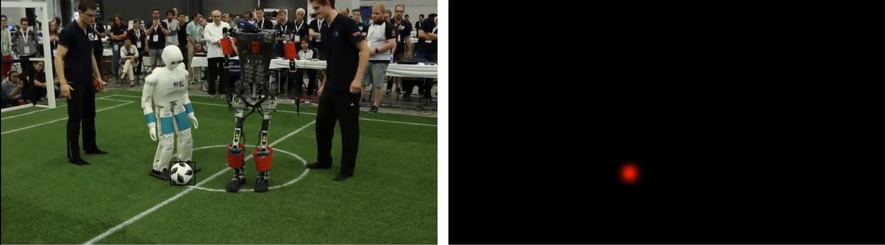

# Soccer Ball Detector with Feedforward Fully Convolutional NeuralNetworks (FCNN)  and Convolutional LSTM

Unofficial implementation of the paper [Detection and Localization of Features on a SoccerField with Feedforward Fully Convolutional NeuralNetworks (FCNN) for the Adult-Size HumanoidRobot Sweaty](http://lofarolabs.com/events/robocup/ws17/papers/Humanoids_RoboCup_Workshop_2017_pape_4.pdf). Despite the ability of FCNNs to capture spatial data, they lack the ability to learn temporal patterns. Convolutional LSTM or Convolutional GRU models have provided solutions for this by retaining information from frames over multiple time steps to draw an inference. A ConvLSTM module is therefore added to the SweatyNet model to predict frames where it fails to detect a ball. The ideas are inspired from [Convolutional Gated Recurrent Networks for Video Segmentation](https://arxiv.org/pdf/1611.05435.pdf).


## Getting Started

```
git clone https://github.com/tridivb/Soccer_Ball_Detector_with_FCNN_and_ConvLSTM.git
```

### Prerequisites

[Python 3.x](https://www.python.org/downloads/)<br/>
[Pytorch 0.4.1](https://pytorch.org/get-started/previous-versions/)<br/>
[Visdom](https://github.com/facebookresearch/visdom)<br/>
[OpenCV 3.x](https://opencv.org/releases.html)<br/>
[Pandas](https://pandas.pydata.org/)<br/>
[ImageIo](https://pypi.org/project/imageio/)<br/>
Numpy<br/>
PIL

## Running the code

Run it from the command line using the following: <br/> 
```python main.py --model 1 --niter 1```<br/>
<br/>
To see list of all available arguments:<br/>
```python main.py --h```<br/>
<br/>
Dataset files can be placed anywhere but please make sure that the annotation file is in csv format and the column order is as *annotation_type, filename, x1, y1, x2, y2, center_x, center_y, width, height*. <br/>
Trained models and sample output files are present in the output directory.

## Results

Sample from testing on an un-annoted dataset



## License

Please respect the original license of the authors for the papers mentioned above and the libraries used for ConvLSTM and ConvGRU.

## Acknowledgments

* ConvLSTM library - https://github.com/ndrplz/ConvLSTM_pytorch
* ConvGRU library - https://github.com/jacobkimmel/pytorch_convgru
* Readme Template - https://gist.github.com/PurpleBooth/109311bb0361f32d87a2
